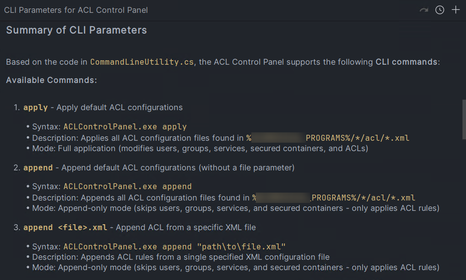

<!-- _class: lead -->

# Agents IA pour Devs

## Au-delà du copier-coller : patterns concrets pour booster votre workflow de travail

---

## Objectif de cette présentation

- **Pas de magie** : des astuces qui marchent aujourd'hui
- **Techniques** pour améliorer la pertinence des agents
- **Retours d'expérience** concrets
- **Interactif** : partagez vos usages !

<!--
Note: Intro rapide, poser le contexte - on va parler de choses concrètes, pas de buzzwords
-->

---

## LLM ≠ Agent IA

**LLM (ChatGPT, Claude...)**

- Question → Réponse
- Stateless, one shot

**Agent IA**

- **Boucle autonome** : Think → Act → Observe → Repeat
- Gère des tâches **multi-étapes**
- Utilise des **outils** (filesystem, fonction IDE, terminal, serveurs MCP...)

<!--
Contexte: le miens. Mon project = IntelliJ + Copilot dispo
MAIS c'est vrai pour les autres IDE et les autres agents aussi

Chat LLM: une réponse et basta ; si besoin de plus, il faut relancer une requete, lui redonner du contexte etc.

L'agent itère jusqu'à atteindre l'objectif. C'est ça qui change tout.
-->

---

## Cas concret #1 : Onboarding projet

**Situation** : Arrivé sur un nouveau projet fullstack

- Comment est-ce que le frontend est servi ?
- Comment est setup l'authentification ?
- Intégration de la DB ?

**Doc :** Souvent conséquente, ou incomplète, ou obsolète

**Avec agent :**

- Exploration autonome du code
- Documentation sur mesure
- Temps gagné considérable

<!--
Exemple en présentant un rapport markdown qui montre les détails a la réponse, avec diagrammes explicatifs etc
-->

---

## Cas concret #2 : Reverse Engineering CLI

**Situation** : Outil interne en C#, **doc introuvable**



<!-- 
donner le prompt pour montrer l'exemple
-->

---

## Les Agents pour tout les usages

**Autres exemples :**

- Génération de tests unitaires / d'intégration
- Documentation
- Dev (dans certaines mesures)
- Revue de code

<!--
Pour des outils rapides, de la structuration de code, des petites features non ambigues etc..
-->

---

## ⚠️ Limites et précautions

**Les agents ne sont pas parfaits**

- **Hallucinations** : peuvent inventer des informations
- **Erreurs subtiles** : code qui compile mais logique incorrecte
- **Compréhension limitée** : contexte métier complexe

**Bonnes pratiques :**

- ✅ **Toujours relire** et valider le code généré
- ✅ **Tester** les solutions proposées
- ✅ **Garder l'esprit critique** : l'agent est un assistant, pas un oracle

**→ Agent = Gain de productivité, mais vous restez aux commandes !**

<!--
Important de rappeler que c'est un outil, pas une solution magique
Le dev garde la responsabilité finale
-->

---

## Booster l'efficacité des agents - Exemple : Recherche dans le code

**L'agent finira surement par trouver**

- Grâce à la boucle Think-Act-Observe
- Il itère jusqu'à satisfaction

**Mais...**

- Consomme beaucoup de tokens
- Peut prendre du temps
- Résultats moins ciblés par défaut

💡 **Comment optimiser leur efficacité ?**

---

## Amélioration #1 : Instructions personnalisées

**Instructions globales** (`global-copilot-instructions.md` pour IntelliJ)

- Environnement : `pwsh 7`, `bash`, `ripgrep`
- Style de code, tooling local

**Instructions par projet** (`.github/copilot-instructions.md`)

- Framework spécifique (Spring Boot, patterns...)
- Conventions du projet
- APIs/endpoints disponibles

**→ Agent adapté au contexte = meilleure efficacité**

<!--
Amélioration de la DX la plus immédiate pour devs

Ex: par défaut les commandes sont celle de linux, donc sur windows tout plante.
-->

---

## Amélioration #2 : Outils spécialisés - Recherche dans le code 1/2

**Recherche basique IDE**

- Fonctionne, mais limité
- Résultats moins ciblés

**Solution : donner accès a un outil spécialisé**

- L'agent a accès au terminal
- Dans son prompt: lui indiquer d'utiliser `ripgrep` pour les recherches

<!--
On peut donner les info d'outils dans le prompt directement ou dans le contexte global/projet
-->

---

## Amélioration #2 : Outils spécialisés - Recherche dans le code 2/2

**Exemple de commandes ripgrep**

```bash
rg "DataSource|JdbcTemplate" --type java
rg "switch.*case.*arg" -B3 -A2 -i
```

**Bénéfices :**

- Recherche **plus rapide** et ciblée
- Query **puissante** (regex, filtres par type)
- **Moins de tokens** consommés
- Ressenti: **Gains de temps et de pertinence** significatifs

<!--
- Ripgrep est 10x plus rapide que grep classique
- VScode embarque ripgrep par défaut pour la recherche
- Le plugin copilot pour IntelliJ est moins bien, donc la ca marche mieux avec ripgrep (pour le moment)
-->

---

## Pattern clé : Agent = Cerveau, Outils = Mains

**❌ Anti-pattern** : Agent fait tout

- Génère HTML + CSS + JS pour slides
- Contexte divisé, fond noyé dans le code

**✅ Pattern** : Séparation des préoccupations

- **Dev** : Prépare le contenu (notes, structure, exemples...)
- **Agent** : formatte le contenu (Markdown)
- **Marp** : gère le rendering et le style
- Focus sur le fond, qualité optimale

**→ La base de cette présentation est générée avec ce pattern !**

---

## Généraliser le pattern

**Ne réinventez pas la roue, combinez !**

---

## Amélioration #3 : Prompts - Trouver l'équilibre

**Trop vague**

- "Explique-moi le projet"
- → Réponse générique, peu utile.

**Trop spécifique**

- "Cherche dans src/main/java/com/app/config/SecurityConfig.java ligne 45..."
- → Vous faites le job de l'agent.

**Juste ce qu'il faut**

- "Comment l'authentification est configurée dans ce projet Spring ?"
- → L'agent explore le code avec ses outils.

---

## Tips Prompts

- **Polution de la fenêtre de contexte**
  - Bien choisir le contexte à fournir
  - Ne pas utiliser la même "discussion" trop longtemps
- **Itération**
  - Reformuler, ajuster les questions
- **Feedback explicite**
  - Dire à l'agent ce qui marche/ne marche pas
  - Rajouter des constraintes si trop générique

---

## Key Takeaways

1. **Agent ≠ ChatGPT** : la boucle change tout
2. **Cas d'usage** : onboarding, reverse engineering, doc, tests, dev...
3. **Optimisez** : instructions globales + projet
4. **Outillez** : ripgrep, outils spécialisés
5. **Combinez** : Agent (cerveau) + Outils (mains)
6. **Équilibrez** vos prompts

**→ Agents + bons outils = productivité exponentielle**

---

## Pour aller plus loin

**Outils mentionnés :**

- Ripgrep : `https://github.com/BurntSushi/ripgrep`
- Marp : `https://marp.app`
- GitHub Copilot instructions

**Nouveauté cette semaine :**

- **mgrep** : « LLM-powered grep, pattern matching en langage naturel »
  `https://github.com/mixedbread-ai/mgrep`

**Le domaine évolue chaque semaine !**

**Serveurs MCP...** 

---

## 💬 Temps d'échange

**Questions :**

- Comment utilisez-vous les agents ou l'IA dans votre workflow ?
- Problèmes rencontrés ?
- Quelles attentes ?

**Partagez vos expériences !**

<!--
Prévoir 3-5 minutes d'échange ici
Possibilité de live demo si pertinent
-->

---

<!-- _class: lead -->

# Merci
